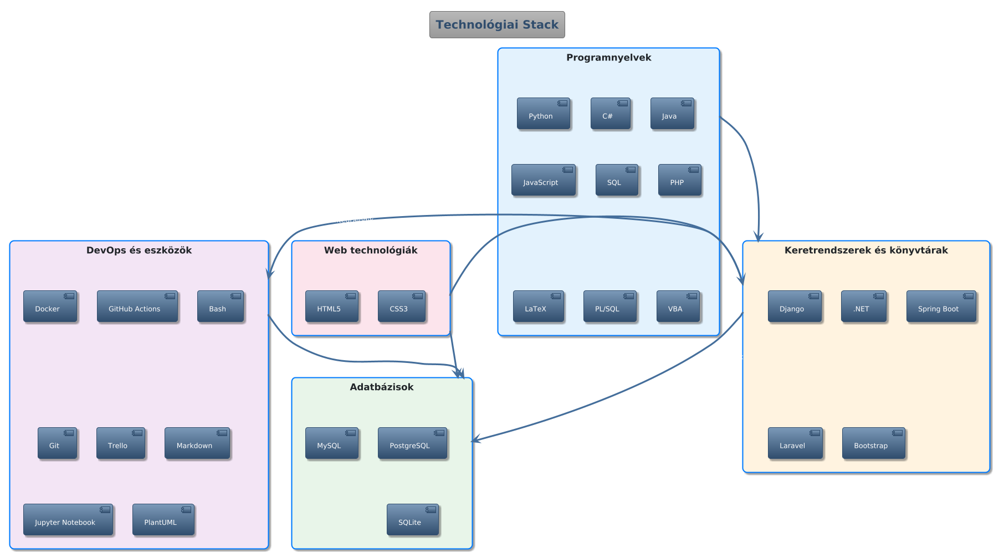

# Üdv, Tóth Dorina vagyok! :wave:

> :uk: [English](README.md) | :hungary: Magyar

Lelkes szoftverfejlesztő vagyok Magyarországról, jelenleg az Eszterházy Károly Katolikus Egyetem Informatikai Fejlesztési Osztályán dolgozom. Főbb érdeklődési területeim a mesterséges intelligencia, gépi tanulás, rendszertervezés, backend- és webfejlesztés.

## :woman_technologist: Bemutatkozás

Gyermekkorom óta lenyűgöz az informatika és a szoftverfejlesztés világa. Programtervező informatikus BSc diplomával rendelkezem, és mindig szívesen tanulok, illetve osztom meg a tudásom. Szeretek mesterséges intelligencián alapuló megoldásokat, API-alapú rendszereket és Retrieval-Augmented Generation (RAG) alkalmazásokat fejleszteni.

## :bar_chart: GitHub statisztikák

## :hammer_and_wrench: Készségek

- **Programnyelvek:** Python, C#, Java, JavaScript, SQL, PHP, LaTeX
- **Technológiák:** HTML5, CSS3, Bootstrap, Django, .NET, Spring Boot, Laravel, PostgreSQL, MySQL, SQLite, Docker, GitHub Actions, Bash, PlantUML, VBA, Jupyter Notebook, Trello, Markdown
- **Soft skillek:** Problémamegoldás, analitikus gondolkodás, csapatmunka, kommunikáció, alkalmazkodóképesség, gyors tanulás

## :file_folder: Projektek

Az alábbi táblázatban megtalálod a nyilvános és kiemelt repóimat. Minden projekthez tartozik egy README a `projects` mappában, a repó nevével megegyezően. Kattints a projektnévre a részletekért:

| Projekt neve | Leírás | Link |
| ------------ | ------ | ---- |
| thesis-langmodels-project-management | Mesterséges intelligencia webalkalmazásokban | [README megtekintése](./projects/thesis-langmodels-project-management.md) |
| ... | ... | ... |

## :mortar_board: Tanulmányok

- **Programtervező informatikus BSc** (2022-2025)  
  Eszterházy Károly Katolikus Egyetem
- **Számítógépes rendszerkarbantartó** (2018-2022)  
  Váci SZC Petőfi Sándor Technikum

## :briefcase: Szakmai tapasztalat

- **Szoftverfejlesztő** @ Eszterházy Károly Katolikus Egyetem (2025-)
- **Webfejlesztő és karbantartó** @ Kepes György Szakkollégium (2022-2025)  
  [szakkoli.uni-eszterhazy.hu](http://szakkoli.uni-eszterhazy.hu/)
- **Demonstrátor** @ Eszterházy Károly Katolikus Egyetem (2023-2024)
- **Webfejlesztő és karbantartó** @ Csath Veronika (2022-2024)  
  [csathveronika.hu](http://www.csathveronika.hu)

## :globe_with_meridians: Elérhetőség

- :email: E-mail: <tothdi03@gmail.com>
- :briefcase: [LinkedIn](https://www.linkedin.com/in/dorina-tóth-045488357/)
- :desktop_computer: [GitHub](https://github.com/Drntth)

## :earth_africa: Nyelvek

- Magyar (anyanyelv)
- Angol (középfok)
- Német (alapfok)

## :handshake: Tagságok

- Kepes György Szakkollégium (2022-2025)

---
Keress bátran, vagy nézd meg a projektjeimet!
