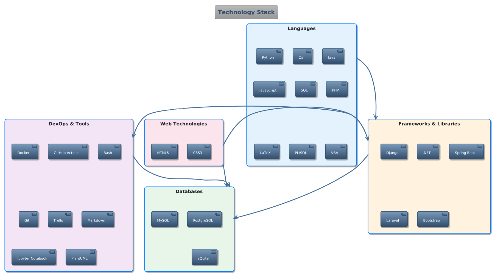

# Hi there, I'm Dorina Tóth! :wave:

I'm a passionate Software Developer from Hungary, currently working at Eszterházy Károly Catholic University IT Development Department. My main interests are artificial intelligence, machine learning, system design, backend development, and web development.

## :woman_technologist: About Me

Since childhood, I've been fascinated by IT and software development. I hold a BSc in Computer Science and am always eager to learn and share knowledge. I enjoy building AI-based solutions, API-driven systems, and Retrieval-Augmented Generation (RAG) applications.

## :bar_chart: GitHub Stats

## :hammer_and_wrench: Skills

- **Languages:** Python, C#, Java, JavaScript, SQL, PHP, LaTeX
- **Technologies:** HTML5, CSS3, Bootstrap, Django, .NET, Spring Boot, Laravel, PostgreSQL, MySQL, SQLite, Docker, GitHub Actions, Bash, PlantUML, VBA, Jupyter Notebook, Trello, Markdown
- **Soft Skills:** Problem-solving, analytical thinking, teamwork, communication, adaptability, quick learning

## :file_folder: Projects

Below you can find a curated list of my public and pinned repositories. Each project has its own README file in the `projects` folder, named after the repository. Click on a project to view its details:

| Project Name | Description | Link |
| ------------ | ----------- | ---- |
| thesis-langmodels-project-management | Artificial Intelligence in Web Applications | [View README](./projects/thesis-langmodels-project-management.md) |
| ... | ... | ... |

## :mortar_board: Education

- **BSc in Software Engineering** (2022-2025)  
  Eszterházy Károly Catholic University
- **Computer System Maintenance Technician** (2018-2022)  
  Váci SZC Petőfi Sándor Technical School

## :briefcase: Experience

- **Software Developer** @ Eszterházy Károly Catholic University (2025-Present)
- **Web Developer & Maintainer** @ Kepes György College for Advanced Studies (2022-2025)  
  [szakkoli.uni-eszterhazy.hu](http://szakkoli.uni-eszterhazy.hu/)
- **Teaching Assistant Demonstrator** @ Eszterházy Károly Catholic University (2023-2024)
- **Web Developer & Maintainer** @ Csath Veronika (2022-2024)  
  [csathveronika.hu](http://www.csathveronika.hu)

## :globe_with_meridians: Find Me Online

- :email: Email: <tothdi03@gmail.com>
- :briefcase: [LinkedIn](https://www.linkedin.com/in/dorina-tóth-045488357/)
- :desktop_computer: [GitHub](https://github.com/Drntth)

## :earth_africa: Languages

- Hungarian (native)
- English (intermediate)
- German (basic)

## :handshake: Memberships

- Kepes György College for Advanced Studies (2022-2025)

---
Feel free to connect or check out my projects!
