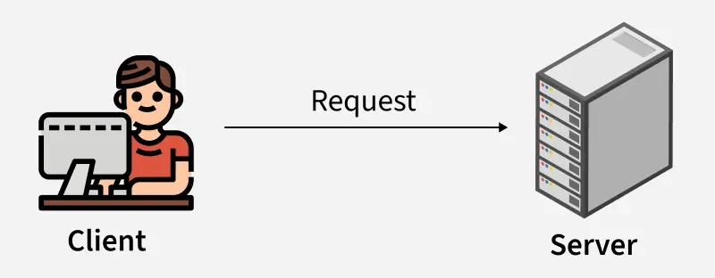
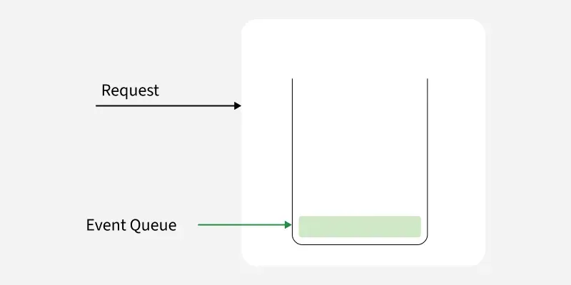
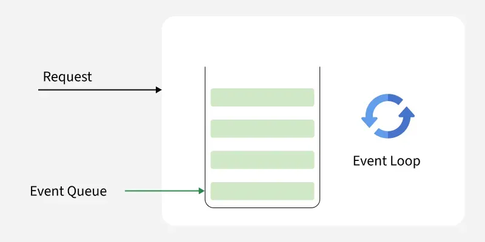
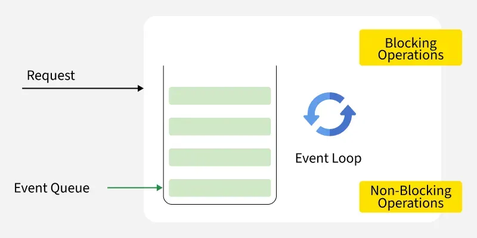
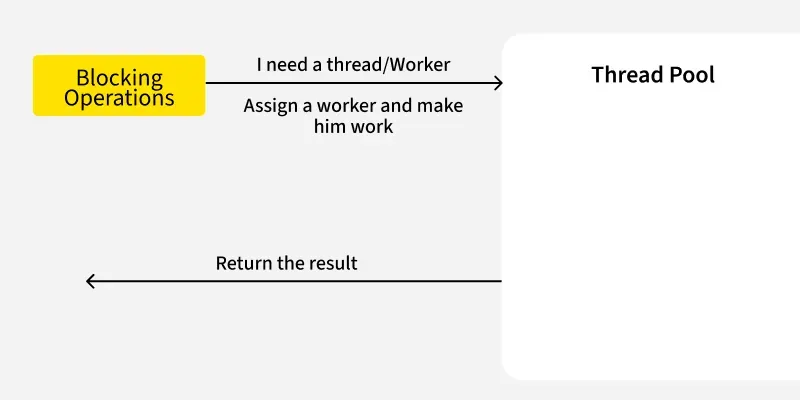

# Node.js alapok

A Node.js egy nyílt forráskódú, platformfüggetlen JavaScript futtatókörnyezet, amely a Google V8 motorjára épül. Lehetővé teszi, hogy JavaScript kódot ne csak a böngészőben, hanem szerveroldalon is futtassunk. Eseményvezérelt, aszinkron I/O modellt használ, így különösen alkalmas nagy teljesítményű, skálázható webalkalmazások, API-k és valós idejű alkalmazások fejlesztésére.

> A JavaScript eredetileg csak böngészőben futott, minden böngésző saját motorral (pl. Chrome: V8, Firefox: SpiderMonkey). Ryan Dahl fejlesztő a Google V8 motort C++-szal kombinálva hozta létre a Node.js-t, így a JavaScript már szerveroldalon is futtathatóvá vált - például fájlkezelésre is alkalmassá téve. Fontos: a Node.js nem könyvtár vagy keretrendszer, hanem JavaScript futtatókörnyezet!

---

## Miért érdemes Node.js-t választani?

Node.js napjaink egyik legnépszerűbb választása modern webalkalmazások fejlesztéséhez. Gyors, skálázható, és lehetővé teszi a teljes stack JavaScript használatát. A fejlesztők több mint 41%-a használja, így a HTML, CSS és JavaScript után a legelterjedtebb technológia. Nem blokkoló, eseményvezérelt architektúrája révén nagy mennyiségű egyidejű kérést képes hatékonyan kezelni - például a Netflix a Node.js bevezetésével 70%-kal csökkentette a rendszerindítási időt.

### Fő előnyök és jellemzők

- **Kiemelkedő teljesítmény:** A Chrome V8 motorra épül, amely a JavaScriptet gépi kódra fordítja, így különösen gyors, főleg I/O-műveleteknél.
- **Egyszálú eseményciklus:** Nem blokkoló, eseményvezérelt modell, amely minimális memóriahasználat mellett is sok egyidejű kérést kezel.
- **Skálázhatóság:** Vízszintesen és függőlegesen is jól skálázható, nagy forgalmú alkalmazásokhoz ideális.
- **Egységes nyelv:** A JavaScript mind kliens-, mind szerveroldalon használható, így egyszerűbb a fejlesztés.
- **Gazdag ökoszisztéma (npm):** Több ezer könyvtár és eszköz érhető el, amelyek gyorsítják a fejlesztést.
- **Valós idejű képességek:** Kiváló chat, élő frissítés és egyéb real-time alkalmazásokhoz.
- **Platformfüggetlenség:** Windows, macOS és Linux rendszereken is fut.

## NPM - Node Package Manager

A Node.js telepítésével automatikusan elérhetővé válik az NPM (Node Package Manager) is. Új projekt indításakor az `npm init` parancsot kell kiadni a terminálban, amely létrehozza a package.json fájlt. Ez a fájl tartalmazza a projekt legfontosabb metaadatait, a függőségeket, a futtatási parancsokat és a belépési pontot is. Az NPM segítségével könnyedén telepíthetünk, frissíthetünk vagy törölhetünk csomagokat, illetve kezelhetjük a projektünk összes külső modulját.

## Tipikus felhasználási területek

- **Web API-k és backend szolgáltatások:** RESTful és GraphQL API-k, mobil- és webalkalmazások backendje, sok egyidejű kérés hatékony kezelése.
- **Valós idejű alkalmazások:** Chatalkalmazások (pl. WhatsApp, Slack), játékok, kollaborációs eszközök, élő közvetítések (pl. Netflix, Twitch), ahol a gyors reakcióidő és a folyamatos adatáramlás kulcsfontosságú.
- **Single Page Application (SPA) backend:** React, Angular, Vue.js alkalmazások backendjének kezelése, dinamikus tartalom kiszolgálása oldalfrissítés nélkül.
- **Mikroszolgáltatás-architektúra:** Könnyű, skálázható, eseményvezérelt architektúra, egymástól független szolgáltatások fejlesztése, felhőalapú alkalmazások.
- **Streaming alkalmazások:** Nagy adatfolyamok feldolgozása pufferelés nélkül (pl. Netflix, Spotify), valós idejű média- és adatstreaming.
- **Parancssori eszközök:** Erőteljes CLI-k készítése npm könyvtárakkal, automatizálási és fejlesztői segédeszközök.
- **IoT (Internet of Things) megoldások:** Aszinkron, eseményvezérelt működés, sok eszköz egyidejű kezelése, valós idejű adatfolyamok kezelése IoT eszközökről, okosotthon-automatizálás, szenzoradatok feldolgozása.
- **Szerver nélküli (serverless) számítás:** AWS Lambda, Azure Functions, Google Cloud Functions - könnyű, gyorsan induló függvények futtatása, költséghatékony skálázás.
- **Adatintenzív alkalmazások:** Nagy mennyiségű adat feldolgozása, valós idejű analitika, NoSQL adatbázisokkal (pl. MongoDB, Firebase) való együttműködés.

### Iparági felhasználás

**Tech startupok:**

- Uber: valós idejű követés, nagy mennyiségű kérés kezelése.
- Netflix: szerveroldali architektúra, gyors tartalomszolgáltatás, valós idejű streaming.
- Trello: valós idejű feladatfrissítés.

**Pénzügy:**

- PayPal: milliós tranzakciók, gyors webalkalmazás.
- Intuit: pénzügyi, adózási szoftverek backendje.

**E-kereskedelem:**

- Walmart: skálázható, nagy teljesítményű alkalmazások.
- eBay: gyors adatcsere, valós idejű élmény.

**Média és szórakoztatás:**

- Spotify: valós idejű streaming, zökkenőmentes élmény.
- BBC: valós idejű interakció, tartalomszolgáltatás több platformon.

---

## Hogyan működik a Node.js?

A Node.js egy eseményvezérelt, nem blokkoló futtatókörnyezet, amely lehetővé teszi a JavaScript kód futtatását böngészőn kívül, főként szerveroldalon. Ellentétben a hagyományos szerveroldali technológiákkal (mint a PHP vagy a Python/Django), a Node.js aszinkron, nem blokkoló feldolgozást kínál, így rendkívül hatékony és jól skálázható valós idejű alkalmazásokhoz. Könnyű architektúrája és egyszálú eseményciklusa révén egyszerre sok párhuzamos kérést képes gyorsan kezelni, ami jelentős teljesítményelőnyt jelent a konkurens szerveroldali megoldásokkal szemben.


*Kép: A kliens-szerver kapcsolatot szemléltető ábra, ahol egy felhasználó (kliens) egy laptopon keresztül küld kérést a szervernek. A kommunikáció irányát egy nyíl és a "Request" felirat jelzi, bemutatva a kliens-szerver architektúra alapjait.*


*Kép: Egy eseményfeldolgozási modellt ábrázoló diagram, amely bemutatja, hogyan kerülnek a kérések az eseménysorba (Event Queue), majd az eseményciklus (Event Loop) dolgozza fel őket, különválasztva a blokkoló és nem blokkoló műveleteket.*


*Kép: Egy folyamatábra, amely szemlélteti, hogyan igényelnek a blokkoló műveletek külön szálat (worker thread), a rendszer hozzárendeli a szálat, elvégzi a munkát, majd visszaadja az eredményt a szálkezelő (Thread Pool) segítségével.*

*Forrás: [GeeksforGeeks - JavaScript Tutorial](https://www.geeksforgeeks.org/node-js/how-node-js-works)*

### Egyszálú eseménykezelő ciklus modell

1. **A kliens elküldi a kérést:** Lehet adatlekérés, fájlolvasás vagy adatbázis-lekérdezés.
2. **Node.js az eseményciklusba helyezi a kérést:** Ha a kérés nem blokkoló, azt egy háttérszál kezeli, miközben a fő szál szabadon marad.
3. **Aszinkron műveletek a háttérben:** Amíg a válaszra vár, a Node.js más feladatokat is elvégez.
4. **Callback végrehajtása:** Amikor a művelet befejeződik, a callback függvény lefut, és a válasz visszakerül a klienshez.

### Klienskérések kezelése: Event Loop és Thread Pool

A Node.js környezetben a klienskérések hatékony kezelése kulcsfontosságú a gyors és skálázható webalkalmazásokhoz. Amikor egy kliens kapcsolatba lép a webalkalmazással, egy kérést küld a webszervernek. Ez a kérés lehet blokkoló (szinkron) vagy nem blokkoló (aszinkron). A Node.js eseményvezérelt architektúrát használ, ahol minden beérkező kérés először egy eseménysorba (Event Queue) kerül. Az eseményciklus (Event Loop) folyamatosan figyeli ezt a sort, és sorban dolgozza fel a kéréseket. A működés megértése - Event Queue, Event Loop és Thread Pool - elengedhetetlen a teljesítmény optimalizálásához és a blokkoló műveletek miatti késleltetések elkerüléséhez.


*Kép: A képen egy kliens és egy szerver közötti kapcsolatot illusztrálnak. A bal oldalon egy emberi alakot ábrázoló ikon látható, aki számítógép előtt ül, piros pólóban. A kliens a "Request" (Kérés) felirattal közvetlen kapcsolatban áll a jobb oldalon elhelyezkedő szerver ikon mellett, amely egy számítógép-szekrényre hasonlít, több réteggel. Az ikonok egyszerűsített stílusban készültek, a háttér világos szürke.*


*Kép: A képen egy görbe nyíl mutat a "Request" feliratú mezőből egy "Event Queue" felé, amely egy üres, függőleges téglalap formájában van ábrázolva. A "Event Queue" alján egy zöld színű sáv látható, amely az események várakozási állapotát jelzi. A háttér világos színű, és a rajz egyszerű, vonalrajzszerű stílusban készült. A megjelenített elemek közvetlenül kapcsolódnak egy informatikai koncepcióhoz, amely az események kezelésére utal.*


*Kép: A képen egy eseménykezelést bemutató ábra látható. Az ábra bal oldalán egy "Request" feliratú nyíl mutat a középen elhelyezkedő dobozra, amely az "Event Queue" (esemény sor) feliratot viseli. A doboz alatt több zöld téglalap található, amelyek az események sorát jelzik. A doboz jobb oldalán egy kör alakú nyíl látható, ami az "Event Loop" (esemény ciklus) szimbóluma, az esemény sor és az esemény ciklus közötti kapcsolatot sugallva. Az ábra szürke háttere kontrasztot biztosít a fehér tulajdonságokkal, kiemelve a bemutatott koncepció fontosságát és tisztaságát.*


*Kép: A képen egy eseményhurok (Event Loop) látható, amely egy blokkoló és nem blokkoló műveleteket bemutató ábrázolást tartalmaz. Az eseményhurok középpontjában egy örvénylátható ikon található, amely az események folyamatos ütemezését szimbolizálja. A bal oldalon egy „Request” jelzés utal a beérkező kérésekre, míg a bal alsó részen az „Event Queue” az események várakozó sorát jelöli. A jobb oldalon a „Blocking Operations” és a „Non-Blocking Operations” feliratok különböztetik meg a két műveletcsoportot, kiemelve a hurok működésének különböző aspektusait.*


*Kép: A képen egy blokkoló működés folyamatábrája látható. Az ábra bal oldalán egy sárga háttérrel kiemelt téma található, ami a "Blocking Operations" feliratot viseli. A folyamat ábrázolja, hogy amikor egy szálra (Worker) van szükség, akkor a következő lépés az, hogy egy munkást (worker) kell kijelölni, és meg kell kezdeni a munkát. Az ábra továbbá jelzi, hogy végül a rendszernek vissza kell adnia az eredményt. A jobb oldalon a "Thread Pool" felirat szerepel, amely üresen áll, jelezve, hogy ott egy szálak gyűjteménye várakozik a feladatok elvégzésére.*

*Forrás: [GeeksforGeeks - JavaScript Tutorial](https://www.geeksforgeeks.org/node-js/how-node-js-works)*

#### Lépésről lépésre: hogyan dolgozza fel a Node.js a kéréseket?

1. A kliens elküldi a kérést a Node.js szervernek.
2. A kérés lehet blokkoló (szinkron) vagy nem blokkoló (aszinkron).
3. A Node.js minden kérést az Event Queue-ba helyez, ahol több felhasználó kérései is sorba rendeződnek (FIFO - First In, First Out).
4. Ha a kérés nem blokkoló, azonnal feldolgozásra kerül, és a válasz visszajut a klienshez.
5. Ha a kérés blokkoló, átkerül a Thread Pool-ba. Ha van szabad szál, a feladatot egy worker végzi el.
6. Ha minden szál foglalt, a blokkoló kérések várakoznak, amíg egy worker felszabadul.
7. A feladat elvégzése után a worker visszaadja az eredményt az Event Loop-nak, amely továbbítja a választ a kliensnek.
8. Ha sok a blokkoló kérés, nő a válaszidő, ezért célszerű aszinkron műveleteket használni, ahol csak lehet.

*Megjegyzés: A „Thread” (szál) egy worker, amely a blokkoló kéréseken dolgozik.*

## Blokkoló (szinkron) és nem blokkoló (aszinkron) műveletek

A két működés közötti különbség jól szemlélteti, miért előnyös a Node.js aszinkron, nem blokkoló modellje a skálázható webalkalmazások fejlesztésében.

### Blokkoló (szinkron) művelet

Blokkoló vagy szinkron művelet esetén a feladatokat egymás után, sorban hajtja végre a program. Az aktuális művelet befejezéséig a program várakozik, és csak utána folytatódik a következő lépéssel. Ez egyszerű, de több kérés vagy időigényes művelet esetén jelentősen lassíthatja a teljesítményt.

[Lásd a példakódot a Példakódok fejezetben.](#blokkoló-szinkron-műveletek)

### Nem blokkoló (aszinkron) művelet

Nem blokkoló vagy aszinkron művelet esetén a hosszabb ideig tartó feladatokat (például fájlolvasás, hálózati kérés) a háttérben kezeli a rendszer. A program közben más feladatokat is végrehajthat, és amikor az aszinkron művelet elkészül, egy callback vagy promise segítségével dolgozza fel az eredményt. Ez a megközelítés ideális nagy teljesítményű, valós idejű alkalmazásokhoz.

[Lásd a példakódot a Példakódok fejezetben.](#nem-blokkoló-aszinkron-műveletek)

---

## Telepítés Linux rendszeren

Node.js használatához először telepítened kell a futtatókörnyezetet és az npm csomagkezelőt a gépedre. Az alábbi lépések Ubuntu/Debian rendszeren működnek, de hasonlóak más Linux disztribúciókon is.

**Előkészületek:**

- Friss, naprakész Linux rendszer (pl. Ubuntu, Debian)
- Terminál hozzáférés (root vagy sudo jogosultság)
- Internetkapcsolat

### 1. Rendszer frissítése

```bash
sudo apt update
sudo apt upgrade
```

### 2. Node.js telepítése

```bash
sudo apt install nodejs
```

### 3. npm telepítése (ha nem települ automatikusan)

```bash
sudo apt install npm
```

### 4. Telepítés ellenőrzése

```bash
node -v
npm -v
```

Mindkét parancs verziószámot kell, hogy visszaadjon, ezzel igazolva a sikeres telepítést.

---

## Példakódok

Az alábbiakban néhány alapvető Node.js példát találsz, amelyek segítenek megérteni a futtatókörnyezet működését és a leggyakoribb felhasználási módokat.

### Egyszerű Node.js példa

Ez a példa egyetlen sort tartalmaz, amely kiír egy üzenetet a konzolra. Jó kiindulópont a Node.js működésének kipróbálásához.

[hello.js](../../../code/nodejs/hello.js)

Futtatás parancssorban:

```bash
node hello.js
```

### Alapvető szerver létrehozása

A következő példában egy egyszerű HTTP szervert hozunk létre, amely minden beérkező kérésre egy szöveges választ küld vissza. Ez jól szemlélteti, hogyan lehet Node.js-ben saját webszervert indítani.

[server.js](../../../code/nodejs/server.js)

**A szerver indítása parancssorban:**

```bash
node server.js
```

Ha elindítod ezt a szervert, és megnyitod a <http://localhost:3000> címet a böngészőben, ezt fogod látni:

```plaintext
Hello, Node.js!
```

**Magyarázat:**

- A `http` modult importáljuk, hogy HTTP szervert tudjunk létrehozni.
- A `createServer()` metódus kezeli a bejövő kéréseket és válaszokat küld.
- A szerver a 3000-es porton figyel, és a böngészőben megjelenik az üdvözlő üzenet.

---

### Blokkoló (szinkron) műveletek

Ebben a példában a `fs.readFileSync()` blokkolja a végrehajtást, amíg a fájl teljesen be nem olvasódik. A kód futása megáll ennél a sornál, és csak a fájl tartalmának kiírása után folytatódik a "2" és "3" kiírásával.

[sync.js](../../../code/nodejs/sync.js)

---

### Nem blokkoló (aszinkron) műveletek

Az aszinkron példában a "2" és "3" már a fájl beolvasása előtt kiírásra kerül, a fájl tartalma csak később jelenik meg, amikor az olvasás befejeződött.

[async.js](../../../code/nodejs/async.js)

### Aszinkron fájlolvasás

Az aszinkron fájlolvasás bemutatja, hogyan lehet a Node.js-ben nem blokkoló módon, callback függvény segítségével fájlt olvasni. Ez a működésmód a Node.js egyik legnagyobb előnye, mivel a szerver közben más feladatokat is el tud látni.

[async_file_reading.js](../../../code/nodejs/async_file_reading.js)

---

## Források

- [Node.js Tutorial](https://www.geeksforgeeks.org/node-js/nodejs)
- [NodeJS Introduction](https://www.geeksforgeeks.org/node-js/node-js-introduction)
- [How Node.js Works?](https://www.geeksforgeeks.org/node-js/how-node-js-works)
