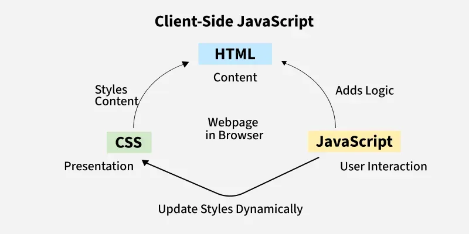
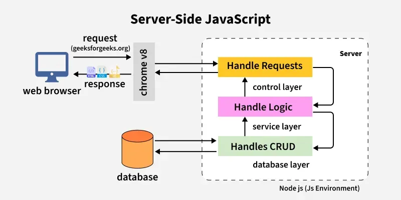

# JavaScript alapok

A JavaScript a webfejlesztés egyik legfontosabb nyelve, amely lehetővé teszi az oldalak interaktívvá és dinamikussá tételét. Segítségével kezelhetjük az eseményeket, módosíthatjuk a DOM-ot, kommunikálhatunk szerverrel, és modern keretrendszereket is használhatunk.
A JavaScript egy programozási nyelv, amelyet dinamikus webes tartalmak létrehozására használnak. Könnyű, platformfüggetlen, egy szálon futó, értelmezett nyelv, amely soronként hajtja végre a kódot, így rugalmas fejlesztést tesz lehetővé.

## Mire használható a JavaScript?

- Interaktív elemek (gombok, menük, animációk)
- Űrlapellenőrzés valós időben
- Dinamikus tartalom betöltése (AJAX, Fetch API)
- Webes alkalmazások (SPA-k, PWA-k)
- Kommunikáció szerverrel (WebSockets)
- Frontend keretrendszerek (React, Vue, Angular)

## Miért érdemes JavaScriptet tanulni?

- Alapnyelv a webfejlesztésben, dinamikus és interaktív funkciók megvalósításához kevés kóddal.
- Nagyon keresett tudás, sok álláslehetőséggel frontend, backend (Node.js) és full stack területen.
- Erős keretrendszerek és könyvtárak támogatják: React, Angular, Vue.js, Node.js, Express.js.
- Objektumorientált és eseményvezérelt, ideális skálázható, reszponzív alkalmazásokhoz.
- Platformfüggetlen, minden modern böngészőben fut telepítés nélkül.
- Nagy cégek (Google, Facebook, Amazon) is használják a technológiai stackjükben.

## Kliens- és szerveroldali JavaScript

**Kliens oldalon** a JavaScript együttműködik a HTML-lel és a CSS-sel. A HTML adja a weboldal szerkezetét, a CSS a stílusokat, a JavaScript pedig életre kelti az oldalt: lehetővé teszi a felhasználói interakciókat (gombkattintás, űrlapkitöltés, animációk). A böngésző közvetlenül futtatja a JavaScript kódot.


*Forrás: [GeeksforGeeks - JavaScript Tutorial](https://www.geeksforgeeks.org/javascript/javascript-tutorial)*

**Szerver oldalon** (pl. Node.js) a JavaScript adatbázisokhoz fér hozzá, fájlokat kezel, biztonsági funkciókat lát el, és válaszokat küld a böngészőknek.


*Forrás: [GeeksforGeeks - JavaScript Tutorial](https://www.geeksforgeeks.org/javascript/javascript-tutorial)*

## Alapvető szintaxis

```javascript
// Változók deklarálása
let nev = "Anna";
const szam = 42;

// Függvény deklarálása
function koszont() {
  console.log("Helló, JavaScript!");
}

// Feltételes elágazás
if (szam > 10) {
  console.log("A szám nagyobb, mint 10.");
}

// Ciklus
for (let i = 0; i < 5; i++) {
  console.log(i);
}
```

## DOM manipuláció

```javascript
// Egy elem kiválasztása és módosítása
const cim = document.getElementById("focim");
cim.textContent = "Üdvözöl a JavaScript!";

// Eseménykezelő hozzáadása
const gomb = document.querySelector("button");
gomb.addEventListener("click", function() {
  alert("Gombra kattintottál!");
});
```

## Modern JavaScript (ES6+)

```javascript
// Nyílfüggvény (arrow function)
const osszeg = (a, b) => a + b;

// Objektum destrukturálás
const szemely = { nev: "Anna", kor: 25 };
const { nev, kor } = szemely;

// Modulok (export/import)
export function udvozlet() {
  return "Szia!";
}
```

## Aszinkron műveletek

```javascript
// Promise és async/await példa
function adatLekeres() {
  return fetch("https://api.example.com/adat")
    .then(valasz => valasz.json());
}

async function mutatAdat() {
  const adat = await adatLekeres();
  console.log(adat);
}
```

## További témák

- Objektumorientált programozás (osztályok, öröklődés)
- Hibakezelés (try/catch)
- Moduláris felépítés
- Böngésző API-k (LocalStorage, Geolocation, stb.)
- Frontend keretrendszerek alapjai
