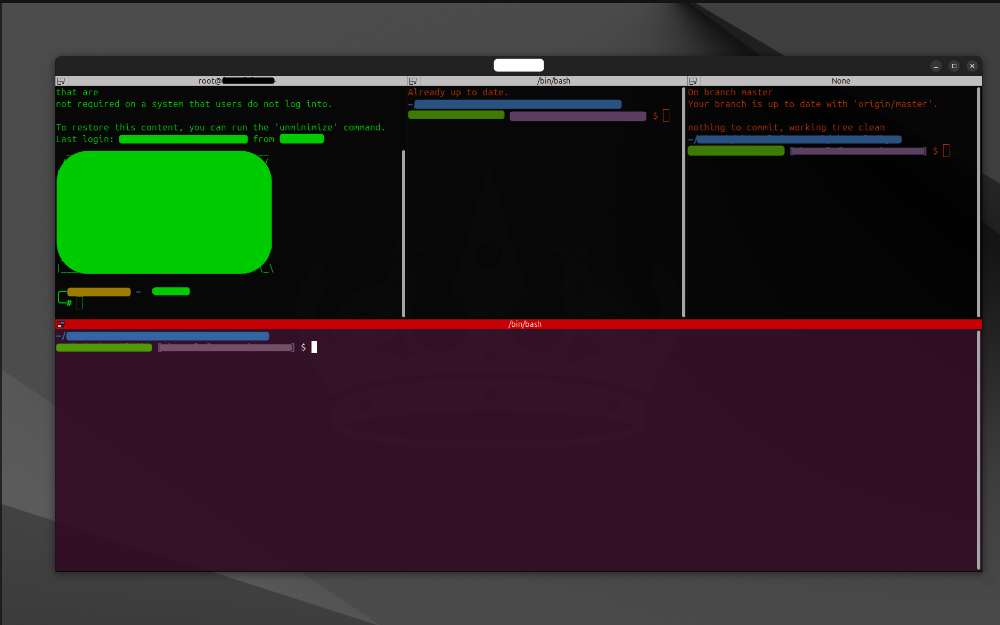

# Terminator - A Linux Terminal Emulator

---

> :uk: English | [:hungary: Magyar](../hu/terminator-guide.md)

---

## Purpose

Terminator is a powerful terminal emulator that allows users to manage multiple terminal sessions efficiently. It provides features like terminal splitting, custom layouts, synchronized typing, and plugin support, making it ideal for developers and system administrators.

---

## Key Concepts

- **Grid Layouts**: Arrange terminals in a grid-like structure for better organization.
- **Custom Profiles**: Define unique settings for different workflows, such as SSH or Git.
- **Synchronized Typing**: Type simultaneously in multiple terminals to execute commands across sessions.
- **Plugins**: Extend functionality with additional features like terminal screenshots.

---

## Installation

Installing Terminator is simple and can be done with a single command:

- **For Ubuntu**:  

  ```bash
  sudo apt install terminator
  ```

---

## How to Use Terminator

Launch Terminator by running the following command in your terminal:

```bash
terminator
```

- **Split Terminal Horizontally**: Use the shortcut `Ctrl+Shift+O`.
- **Split Terminal Vertically**: Use the shortcut `Ctrl+Shift+E`.
- **Clear the Active Terminal**: Use the shortcut `Ctrl+Shift+X`.
- **Collapse Terminal Panes**: Right-click on the pane and select "Close".

---

## Shortcuts

| Action                  | Shortcut                                   |
|-------------------------|--------------------------------------------|
| Split Horizontally      | `Ctrl+Shift+O`                             |
| Split Vertically        | `Ctrl+Shift+E`                             |
| Add Tab                 | `Ctrl+Shift+T`                             |
| Resize Panes            | `Ctrl+Shift+Arrow Keys`                    |
| Synchronized Typing     | `Ctrl+Shift+I`                             |
| Clear Active Terminal   | `Ctrl+Shift+X`                             |
| Rename Session          | `Alt+Shift+X`                              |
| Move Tab Left           | `Alt+Shift+Left` or `Ctrl+Shift+PageUp`    |
| Move Tab Right          | `Alt+Shift+Right` or `Ctrl+Shift+PageDown` |
| Next Tab                | `Ctrl+PageDown`                            |
| Previous Tab            | `Ctrl+PageUp`                              |
| Resize Panes            | `Ctrl+Shift+Arrow Keys`                    |
| Focus Between Panes     | `Alt+Arrow Keys`                           |

---

## Best Practices

### Saving and Loading Layouts

Use the GUI preferences editor to save and load layouts for different workflows. This allows you to quickly switch between setups tailored to specific tasks.

- **Save a Layout**: Layouts are automatically saved in the configuration file located at `~/.config/terminator/config`.
- **Load a Layout**

  - **Command-Line Method**: Use the following command to load a specific layout:

  ```bash
  terminator --layout=<layout_name>
  ```

  - **GUI/Shortcut Method**:
    - Open the Terminator window.
    - Press `Alt + L` to open the layout selection menu and load your own config.
    - Alternatively, right-click in the terminal window, choose **Layouts**, and then select your own config.

### Using Profiles

Create custom profiles for specific tasks. Profiles allow you to define unique settings like colors, fonts, and commands for different workflows.

Example of a profile for SSH:

```ini
[[ssh]]
  background_darkness = 0.9
  background_type = transparent
  foreground_color = "#00ff00"
  title_hide_sizetext = True
```

### Enabling Plugins

Extend Terminator's functionality by enabling plugins. For example:

- **TerminalShot**: Take screenshots of your terminal.
- **LaunchpadCodeURLHandler**: Handle URLs directly in the terminal.

To enable plugins, add them to the `enabled_plugins` field in the configuration file:

```ini
[global_config]
  enabled_plugins = TerminalShot, LaunchpadCodeURLHandler
```

### Dynamic Adjustments

#### Dynamic Layouts

Terminator allows you to dynamically modify layouts during runtime:

- **Resize Panes**:

  - Use `Ctrl+Shift+Arrow Keys` to resize panes dynamically.

- **Rearrange Panes**:

  - Drag and drop panes to rearrange them as needed.

#### Assigning Custom Titles

You can assign custom titles to individual terminal panes to better organize your workspace.

- **Using the GUI**: Right-click on the terminal pane and select "Set Title".
- **Using the Command Line**: Launch Terminator with a custom title:

  ```bash
  terminator --title="<custom_title>"
  ```

#### Synchronized Typing

Synchronized typing allows you to type simultaneously in multiple terminals. This is particularly useful when you need to execute the same commands on multiple servers.

- **How to Enable**:

  - Press `Ctrl+Shift+I` to enable synchronized typing.

- **Description**:

  - All selected terminals will receive the same input simultaneously.

---

## Common Pitfalls

- **Terminator Does Not Start**: Ensure that Python is installed and is the correct version, as Terminator is Python-based. If the issue persists, try running Terminator in debug mode to get more detailed error messages:

```bash
terminator --debug
```

- **Configuration File Corruption**: If the configuration file becomes corrupted, delete or rename `~/.config/terminator/config` and restart Terminator to regenerate it. Alternatively, reinstall Terminator:

  ```bash
  sudo apt install --reinstall terminator
  ```

- **Unresponsive Shortcuts**: Ensure that shortcuts are not overridden by other applications.

- **Layouts Not Saving Properly**: Changes to layouts are not saved after closing Terminator. Ensure that the configuration file is writable and that you save the layout explicitly using the GUI or by editing the configuration file manually.

---

## Example configuration

Below is an example of a Terminator configuration file that demonstrates how to set up profiles, layouts, and commands. This configuration includes:

- **Profiles**: Custom profiles for SSH and Git workflows.
- **Layouts**: A layout with multiple panes, including SSH and Git commands.
- **Commands**: Predefined commands for specific workflows.

You can find the full example Terminator configuration file in [own-config-1](../../../code/terminator/own-config-1).

Here is an example of how Terminator looks with a custom layout:



### How to Use the Example Configuration

1. Copy the example configuration file to your Terminator configuration directory:

```bash
cp /path/to/example/own-config-1 ~/.config/terminator/config
```

2. Open the configuration file and update the # comments to reflect your own settings. For example:

- Replace `# own ssh connection` with your actual SSH command, such as:

```bash
command = ssh user@your-server.com
```

- Replace `# own path to git repository` with the path to your Git repository, such as:

```bash
command = cd /home/your-user/git-repo && git pull && bash
```

3. Restart Terminator:

```bash
terminator
```

3. Load the layout:

  - **Command-Line Method**:
    Use the following command to load a specific layout:

    ```bash
    terminator --layout=own-config
    ```

  - **GUI/Shortcut Method**:
    - Open the Terminator window.
    - Press `Alt + L` to open the layout selection menu and load your own config.
    - Alternatively, right-click in the terminal window, choose **Layouts**, and then select your own config.

---

## Sources

- [Terminator Documentation](https://gnome-terminator.readthedocs.io/en/latest/index.html)
- [GitHub Repository](https://github.com/gnome-terminator/terminator)
- [Terminator Plugins](https://gnome-terminator.readthedocs.io/en/latest/plugins.html)
